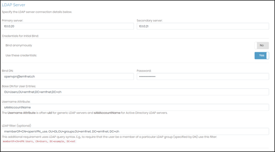

# Analyse
Pour ce projet, le but est de mettre en place un serveur Active Directory pour centraliser tous les accès EMFNet. L’idée est de rediriger l’authentification des systèmes (Radius, Nutanix, VPN, etc.) vers cet AD afin de pouvoir n’utiliser plus qu’un seul login pour tous les systèmes et ainsi éviter de devoir se souvenir quel compte correspond à quel appareil ou interface.

## Cahier des charges
* Centraliser les accès des systèmes vers un AD
* Mettre en place un serveur Active Directory
* Le serveur RADIUS relaie les requêtes à l’AD
* Création de groupes / utilisateurs
* Gestion des droits
* Migration des services
    * Radius
    * Nutanix
    * PRTG
    * SonicWall
* Migration des utilisateurs
* Rédiger une documentation pour les utilisateurs

# Conception

## Situation initiale
Sur le schéma ci-dessous, lorsqu’un utilisateur souhaite se connecter à un périphérique réseau ou à des interfaces de management, il lui faut utiliser plusieurs identifiants différents. Cela implique une mise en place d’outils comme KeePass pour pouvoir se rappeler quel mot de passe et quel nom d’utilisateur utiliser pour se connecter.
Ici, il nous faut 6 comptes et mot de passe différents à retenir :


## Situation désirée
Notre projet consiste donc à centraliser tous les accès afin que l’utilisateur puisse accéder aux périphériques et aux interfaces avec un seul et même identifiant :


!!! note

    Comme les périphériques réseau (switches, routeurs, etc.) n’utilisent pas le protocole LDAP (AD), le serveur RADIUS sert d’intermédiaire. RADIUS relaie les requêtes vers l’AD afin que celui-ci vérifie les informations d’identification.

## AGDLP
Lors de la mise en place de l’AD, il nous faut réfléchir à un concept AGDLP afin d’avoir un aperçu global de l’infrastructure à mettre en place.


# Réalisation
## Intégration sur AD
Maintenant que les serveurs DNS et DHCP sont installés et fonctionnels, il faut commencer à migrer les services vers l’AD.
Nous allons commencer par les utilisateurs OpenVPN et Jumphost ainsi que le serveur RADIUS car il s’agit de services et des utilisateurs les plus utilisés et dont il est important de migrer en premier.

## OpenVPN
### Règles pares-feux
Comme le VPN se trouve dans la DMZ, il faut d’abord ajouter deux règles sur les pares-feux afin de le laisser communiquer avec les AD qui se trouve dans le MGMT :


### Configurations d’authentification
Depuis l’interface OpenVPN, aller dans la section « Authentication-LDAP » :


Puis, insérer les informations permettant de se connecter avec les identifiants qui se trouvent sur les serveurs AD :



Enfin, dans les « settings » des authentifications, sélectionner le bouton « LDAP » :


## Jumphost
En ce qui concerne le jumphost, nous avons changé l’adresse du DNS puis avons intégré la VM dans le domaine du nouvel AD « emfnet.ch ».


## Radius
Pour que le serveur RADIUS puisse rediriger les requêtes d’authentification qu’il reçoit des périphériques réseau vers l’AD, il faut que le service FreeRADIUS puisse communiquer avec le serveur AD.
### Configurations LDAP – Joindre le domaine AD
Pour se faire, installer et configurer **freeradius** sur le serveur RADIUS :

```bash
sudo apt-get update
sudo apt-get install freeradius freeradius-ldap
```
Puis configurer le fichier de configurations LDAP (/etc/freeradius/3.0/mods-enabled/ldap) :
```bash
server = "ad.example.com"             # Replace with your AD server's address
identity = "cn=binduser,dc=example,dc=com"  # Replace with an AD user with bind permissions
password = "binduser_password"        # Password for the bind user

base_dn = "dc=example,dc=com"       # Replace with your AD domain
filter = "(sAMAccountName=%{%{Stripped-User-Name}:-%{User-Name}})"

start_tls = yes                     # Enables TLS for security
# Set the default_pool setting to optimize connections to the AD server
default_pool {
    start = 5
    min = 3
    max = 32
    spare = 3
```
Activer le module LDAP dans FreeRADIUS en effectuant un lien symbolique du fichier de configuration (mods-available) vers le répertoire « mods-enabled » (si ce n’est pas déjà fait) :

```bash
ln -s /etc/freeradius/3.0/mods-available/ldap /etc/freeradius/3.0/mods-enabled/ldap
```
Afin que les utilisateurs qui se trouvent sur l’AD puissent utiliser leurs identifiants pour se connecter sur les périphériques réseau, il faut indiquer à FreeRADIUS d’utiliser « ldap » dans le fichier « /etc/freeradius/3.0/sites-enabled/default »


