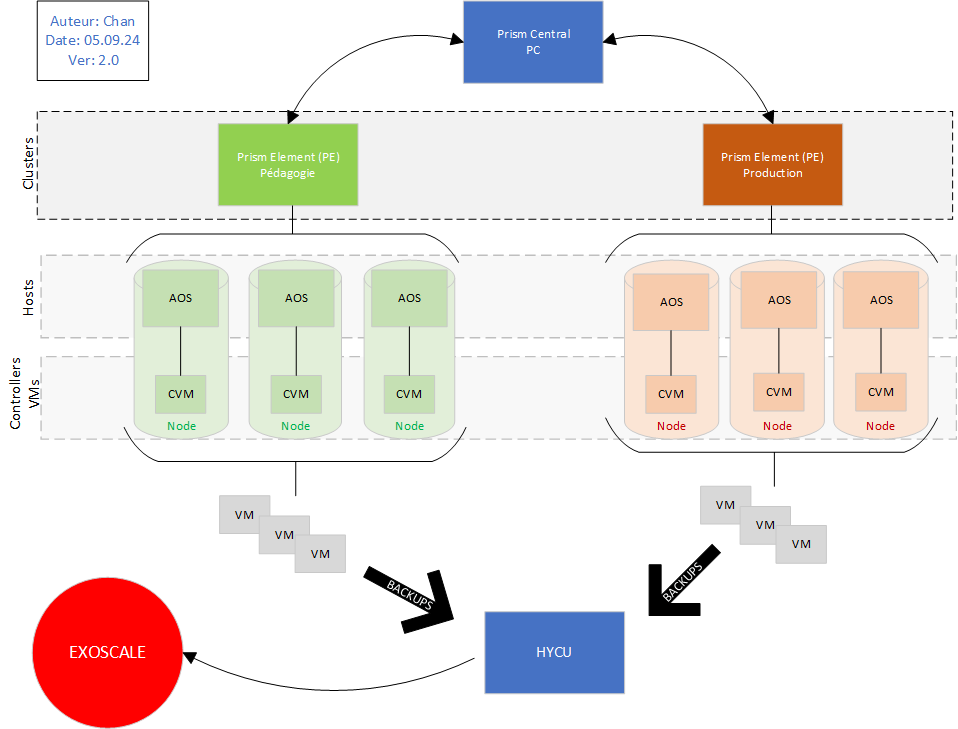
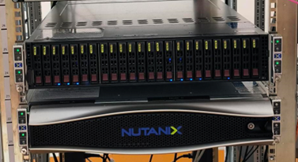

# Nutanix

## Termes techniques
| Acronyme | Description                                                                          |
|----------|--------------------------------------------------------------------------------------|
| PC       | Prism Central                                                                       |
| PE       | Prism Element                                                                       |
| AOS      | Acropolis Operating System                                                         |
| AHV      |                                                                                     |
| CVM      | Controller Virtual Machine                                                         |
| Cluster  | Groupe de minimum 3 nodes physiques qui fonctionnent comme une seule entité        |
| Node     | Infrastructure hyperconvergée Serveur physique qui fait partie d’un cluster Composé d’un CPU, RAM et Disques durs |

## Qu’est-ce que c’est
Nutanix est une entreprise américaine qui propose une plateforme logicielle qui combine le stockage, le calcul et la virtualisation tout en un afin de mettre en place des environnements de cloud privé plus simple à gérer et à déployer.
« Prism » est la web console qui permet d’avoir un aperçu de l’ensemble des clusters et de l’infrastructure. La gestion est centralisée et les déploiements en multicloud sont flexibles :

Le schéma ci-dessus représente l’infrastructure Nutanix mise en place à l’EMF :

* Le PC permet une gestion centralisée des deux clusters (Pédagogie et Production) et des VMs
* Les deux PE possèdent chacun 3 nodes composés d’un AOS et d’un CVM
* Les nouvelles VMs créées sont réparties entre les 3 AOS
    * La répartition des VMs est gérée par les CVM
    * Elles peuvent être gérées par le PC + le cluster dans lequel elle se trouvent
* Les backups des VMs se font de manière automatisée par HYCU
* Les backups sont stockés sur la plateforme de cloud computing « Exoscale »

Voici les racks Nutanix mis en place en salle B22 :

Les 6 LEDS allumées indiquent qu’il y a 6 nodes (composés d’un Hypervisor AHV et d’un CVM).